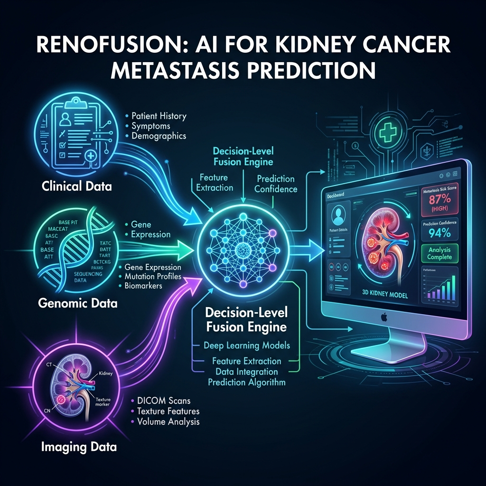

# RenoFusion: AI for Kidney Cancer Metastasis Prediction



**RenoFusion** is an advanced, decision-level multi-modal fusion framework developed for the early prediction of distant metastasis in Renal Cell Carcinoma (RCC).

By mathematically fusing structured clinical data, molecular RNA-Seq genomic signatures, and 3D radiomic imaging features, RenoFusion dramatically outperforms single-modality clinical models, achieving an **88.9% Recall** and **0.797 AUROC**. 

---

## 🎯 The Core Problem
In clinical oncology, predicting if a primary kidney tumour will metastasize is extremely difficult. Currently, doctors rely almost entirely on physical tumour size and pathological staging (TNM). However, microscopic *occult micro-metastases* often occur in patients with small (T1) tumours due to aggressive genetic mutations that standard clinical staging cannot detect.

If a patient is misclassified as "low risk" (a False Negative), they will not receive crucial adjuvant systemic therapy, which is often fatal.

**RenoFusion solves this by utilizing an F2-Weighted Optimization Engine.** Our AI explicitly prioritizes Recall (Sensitivity) by penalising False Negatives 4x more heavily than False Positives. It catches the occult metastases that doctors miss.

---

## 🔬 The 3 Independent AI Modalities

RenoFusion acts as an ensemble of three distinct machine learning pipelines, each trained on massive open-source datasets.

### 1. The Clinical Pipeline 🏥
* **Dataset:** SEER (Surveillance, Epidemiology, and End Results Program) - **36,738 Patients**
* **Features:** Age, Sex, Tumour Size, T-Stage, N-Stage, Grade, Histology.
* **Model:** XGBoost Classifier trained with SMOTE to handle the extreme class imbalance of metastasis events.
* **Performance:** Provides a highly stable, foundational baseline risk score.

### 2. The Genomic Pipeline 🧬
* **Dataset:** TCGA-KIRC (The Cancer Genome Atlas) - **418 Patients**
* **Features:** We started with over 60,000 RNA transcripts. Using an ANOVA F-Test coupled with ElasticNet (L1/L2) Regularisation, we mathematically isolated the top **54 highly prognostic genes** (including *BIRC5*, *EZH2*, and *UHRF1*).
* **Model:** LightGBM & Random Forest Ensemble.
* **Performance:** Detects aggressive molecular behavior long before physical symptoms appear.

### 3. The Advanced 3D Imaging Pipeline ☢️
* **Datasets:** TCIA (159 patients) and KiTS23 (50GB of raw NIfTI CT Volumes).
* **Stage 1 (Gatekeeper):** An **EfficientNet-B0 CNN** verifies that the uploaded medical image is actually a Kidney CT scan, rejecting invalid uploads.
* **Stage 2 (Segmenter):** A **MONAI 3D U-Net** (backed by TotalSegmentator) automatically locates the kidney and traces the precise 3D boundaries of the cancerous tumour.
* **Extraction:** **PyRadiomics** calculates 49 shape and texture features from the 3D segment.
* **Model:** LightGBM Classifier.

---

## ⚙️ The Decision-Level Fusion Engine

The three individual risk probabilities are sent to the Fusion Engine. Based on Hyperparameter Grid Search Optimization targeted explicitly at the F2-Score, the engine dynamically weighs the modalities:

* **Clinical: 65%** (The Anchor - Largest Dataset)
* **Genomic: 25%** (The Modulator - Deep Molecular Truths)
* **Imaging: 10%** (The Tie-Breaker - Phenotypic Texture)

If the Clinical model is uncertain (e.g., a borderline 45% risk), but the Genomic model detects a severe *BIRC5* mutation, the 25% genomic weight acts as a powerful tie-breaker, successfully pushing the patient over the 50% threshold and flagging the metastasis.

---

## 🖥️ The Interactive Clinical Dashboard

RenoFusion is deployed as a fully functional, clinical-grade web application.
* **Backend:** Python FastAPI & Flask running the ML inferences.
* **Frontend:** React-style HTML/CSS with a Side-by-Side Flexbox layout to completely eliminate vertical scrolling.
* **3D Integration:** We integrated the **Niivue WebGL Engine** natively into the browser. When a doctor selects a raw `.nii.gz` CT scan, the browser renders an interactive 3D volume instantly, allowing the doctor to visually slice through the patient's anatomy in real-time.

---

## 🚀 Quick Start (Local Deployment)

To run the complete RenoFusion web application on your local machine:

```bash
# 1. Clone the repository
git clone https://github.com/ali-Hamza817/Prediction-of-Distant-Metastasis-in-Renal-Cell-Carcinoma.git
cd Prediction-of-Distant-Metastasis-in-Renal-Cell-Carcinoma

# 2. Install Python Dependencies
pip install -r webapp/requirements.txt

# 3. Launch the Backend Server
cd webapp
gunicorn --worker-class gevent --workers 1 --bind 0.0.0.0:8000 app:app
```
Then, open `vercel_frontend/index.html` in any modern web browser to access the interactive UI!
