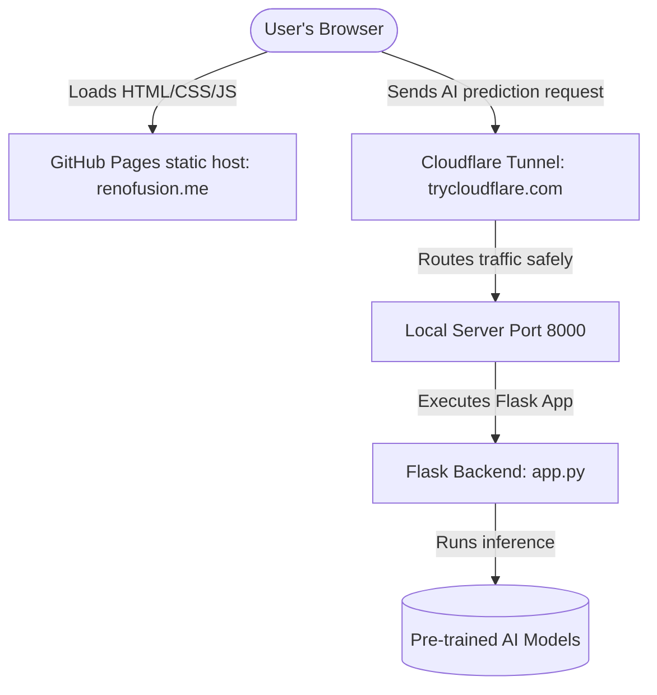

# RenoFusion — System Architecture & Deployment Guide

This guide explains the deployment workflow, hosting setup, and architecture of RenoFusion. It clarifies why you have two repositories and how the frontend and backend communicate.

---

## 🗺️ System Architecture

RenoFusion consists of two separate components:



### 1. The Frontend (Client-Side)
- **What it is:** Static files (`index.html`, `app.js`, `style.css`) that run directly inside the visitor's browser.
- **Where it is hosted:** **GitHub Pages** (via the repository `ali-Hamza817.github.io`).
- **Domain:** Configured with your Namecheap domain (`renofusion.me`).
- **Role:** Displays the UI, collects user inputs, sends data to the backend API, and renders the predictions.

### 2. The Backend (Server-Side)
- **What it is:** A Python Flask application (`webapp/app.py`) that loads the heavy AI weights and processes inputs.
- **Where it runs:** Locally on your university/compute server (port 8000) where Python, LightGBM, XGBoost, and GPUs are available.
- **Role:** Takes inputs, executes mathematical fusion algorithms, runs model inference, and returns JSON data.

### 3. Cloudflare Tunnel (The Bridge)
- **Why it is needed:** Because your backend runs on a local machine, public browsers on the internet cannot access `http://localhost:8000`.
- **How it works:** The Cloudflare tunnel creates a secure connection from your local port 8000 to Cloudflare, providing a public address (e.g., `https://emma-directly-embedded-objects.trycloudflare.com`).

---

## 📂 Why Do You Have Two Repositories?

To keep your project secure, clean, and functioning, the system is separated into two repositories:

1. **`ali-Hamza817.github.io` (Frontend Repository)**
   - **Contents:** Only the static website files (`index.html`, `app.js`, `style.css`).
   - **Why:** GitHub Pages is a free, high-speed static host. It **cannot run Python or AI models**. It only serves files to browsers.

2. **`Prediction-of-Distant-Metastasis-in-Renal-Cell-Carcinoma` (Main / Backend Repository)**
   - **Contents:** The Python source code (`app.py`), the trained model weights (`.pkl`, `.json` files), research notebooks, and data processing scripts.
   - **Why:** This holds the intellectual property of the research, the datasets, and the heavy code that must run on a machine with Python installed.

---

## 🛠️ Step-by-Step Deployment Flow

### Step 1: Run the Backend Server
On your compute server, start the Gunicorn server in the background:
```bash
cd /home/administrator/Desktop/RCC/webapp
nohup gunicorn app:app --bind 0.0.0.0:8000 --workers 2 --threads 4 --worker-class gthread --timeout 120 --log-level info > /home/administrator/Desktop/RCC/logs/gunicorn.log 2>&1 &
```

### Step 2: Start the Cloudflare Tunnel
Start the tunnel to bridge your local port 8000 to a public URL:
```bash
cd /home/administrator/Desktop/RCC
nohup ./tools/cloudflared-linux-amd64 tunnel --url http://localhost:8000 > /home/administrator/Desktop/RCC/logs/tunnel.log 2>&1 &
```

### Step 3: Get the Active Tunnel URL
Check the active tunnel URL by reading the tunnel metrics:
```bash
curl -s http://localhost:20241/metrics | grep tunnel_user_host
```
This will print your active public URL, for example:
`https://emma-directly-embedded-objects.trycloudflare.com`

### Step 4: Update the Frontend URL & Deploy
1. Open the frontend `app.js` file.
2. Update the first line to point to your new tunnel URL:
   ```javascript
   const API_BASE_URL = "https://your-new-url.trycloudflare.com";
   ```
3. Commit and push the frontend changes to GitHub:
   ```bash
   cd /home/administrator/Desktop/ali-Hamza817.github.io
   git add app.js
   git commit -m "update tunnel URL"
   git push origin main
   ```
Within 1–2 minutes, GitHub Pages will automatically deploy the updated frontend to `renofusion.me`.

---

## ❓ Frequently Asked Questions

### What is Vercel? Do I need it?
**Vercel** is another host for frontend web applications (similar to GitHub Pages). You have a folder named `vercel_frontend` inside your main repository which was used for testing frontend builds. Since your site is fully deployed and working on **GitHub Pages**, **you do not need Vercel.** You can ignore Vercel completely.

### Can I merge everything into one repository?
While it is technically possible to serve GitHub Pages from a folder in your main repository, it is **highly recommended to keep them separate**. If you put your datasets and python models in the public GitHub Pages repository, anyone on the internet will be able to download your raw models and patient data. Keeping the backend code in `Prediction-of-Distant-Metastasis-in-Renal-Cell-Carcinoma` keeps your research secure.
